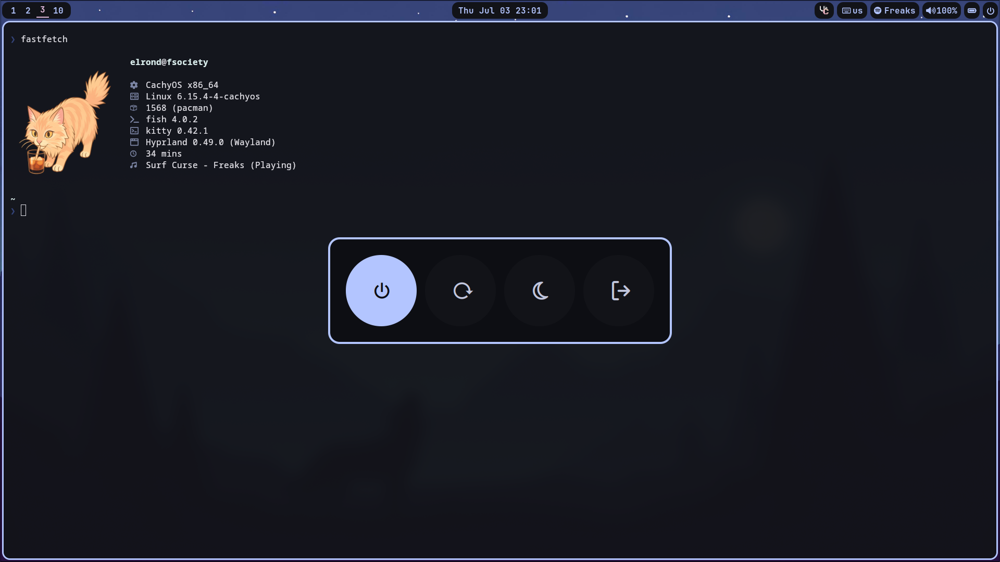
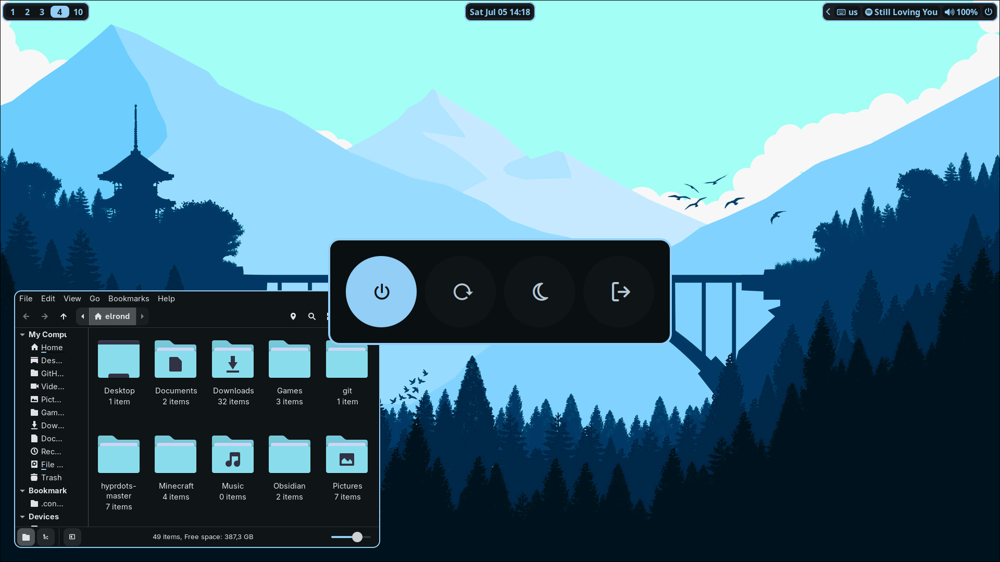

# My Current Hyprland Dotfiles

#### No fancy effects, no dynamic wallpaper and color things. 

#### A simple config that just works (on my machine of course)




---

### DISCLAIMER
This repo is not ready for public use, these are my personal dotfiles. No guarantee it will work on your machine — works on mine.

---

### Some notes for people gonna use it

I use paru btw so if you'll use yay then remove the ``alias yay="paru"`` line in ``/.config/fish/config.fish``

If you are not using nvidia gpu you should delete the nvidia fix env's in hyprland.conf

---

# Used packages
Can be found on pacman and aur

## Hyprland, customization and my general workflow

### Hypr Ecosystem
```
hyprland
hyprlock
hyprpicker
hyprshot
```
### Topbar
```
waybar
```
### Volume Control
```
pulsemixer
```
### Notification Daemon
```
swaync
```
### XWayland screenshare fix
```
xwaylandvideobridge
```
### App Launcher
```
rofi-wayland
```
### Emoji Picker
```
rofi-emoji
```
### Clipboard
```
cliphist
wl-clip-persist
```
note that this config needs to rofi-wayland installed if you gonna use clipboard history, feel free to change
### Wallpaper
```
swww
waypaper
```
### Screenshot annotation
```
swappy
```
## Terminal
### Terminal Emulator
```
kitty
```
### Terminal File Manager
```
yazi
```
### User Shell
```
fish
```
#### Other terminal related packages, for fish config functionality
```
fastfetch
eza
ffmpeg
expac
fisher
```

#### Fisher packages
**for prompt configration**
```
ilancosman/tide@v6
```
use ``fisher install ilancosman/tide@v6`` to install it. ``tide configure`` to configure the prompt.

## Desktop Customization

```
qt6ct
catppuccin-gtk-theme-mocha
papirus-folders-catppuccin-git
catppuccin-qt5ct-git
papirus-folders-catppuccin-git
papirus-icon-theme
apple_cursor
```

### my other personal preferences
#### Browser
```
zen-browser
```
#### File Manager and Plugins
```
thunar
tumbler
thunar-archive-plugin
```
#### Music Player
```
spotify-launcher
```
#### Task Manager
```
mission-center
```
#### Disk Utility
```
gnome-disk-utility
```
#### Text Editor
```
vscodium
```
#### Discord Client
```
vesktop
```
#### Note Taking App
```
obsidian
```
#### App Entry Editor
```
libre-menu-editor
```
